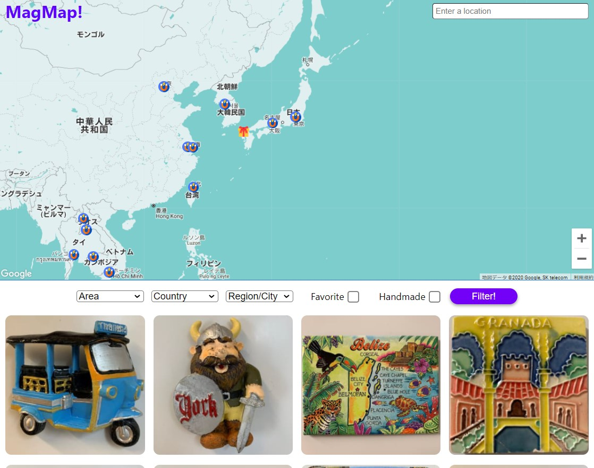

# CC16 Project Solo Web App MVP

This was created during my time as a student at Code Chrysalis.
Main focus is on manipulating React and Google Map API.

### Technologies

- Google Maps API
- React
- Cloudinary
- Express
- NodeJS
- PostgreSQL

## Mag Map!

I'm a huge fun of the fridge magnet. Everytime I go somewhere, I buy a local magnet there.
my collection is so cool and enjoyed looking at lots of magnets on the fridge, but because I collect too many magnets, like more than 100, I can't display most of my magnets, and I just store them in a box. Oh what a pity.
Also I was being afraid that I forget where I bought them or who gave me.

To solve my problem, I created this App.
Mag Map! enebles you to display the magnets with the location in the map, so that you can see where you bought each magnets as well enjoying the magnets display.

- [Mag Map!](https://magnet-map.herokuapp.com/)

You can add a magnet to the exact place on the map with some information (owner, hunter, comment) and of course a photo of your magnet.
If you are not really sure about the place on the map, you can search the place from the search bar and choose the place from the suggestion, then the map will be moved to there (Google Map Geocording).
Also you can choose favorite or handmade.
If the owner and the hunter are different, icon on the map will be a gift icon.

Once a magnet are registerd, latitude, longitude and the town information are automatically registered at the same time (Reverse Geocording). Then the photo is shown in the grid down below, or you can see the magnet with information on the map by clicking the pin.
You can also modify or delete the magnet from the pin.
When you click the photo in the grid map center will move to the exact place automatically so it will remind you of the place you get the magnet.
Also, there is a filter bar in the middle, and you can filter the magnets by area, country, region, favorite and handmade.

Feel free to play around with Mag Map! and register your magnets!
It's super exciting to collect magnets all over the world.

Thank you for reading me.
